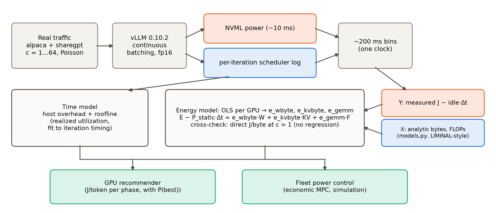
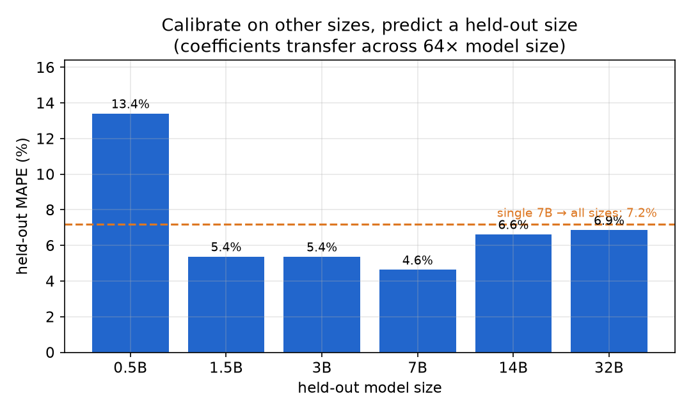
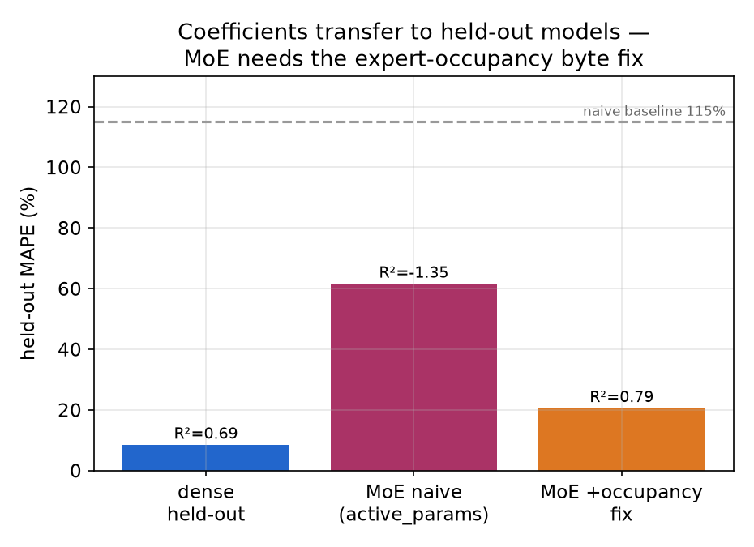
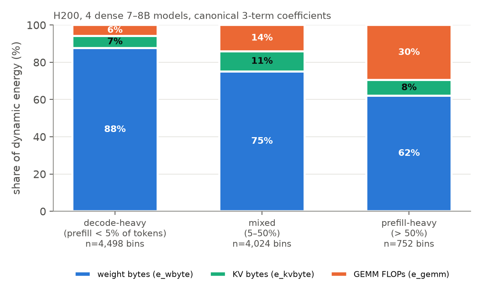
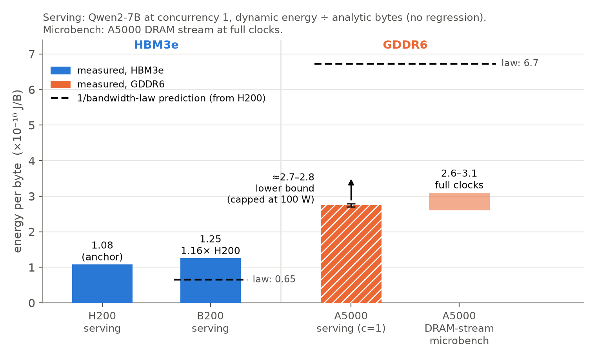
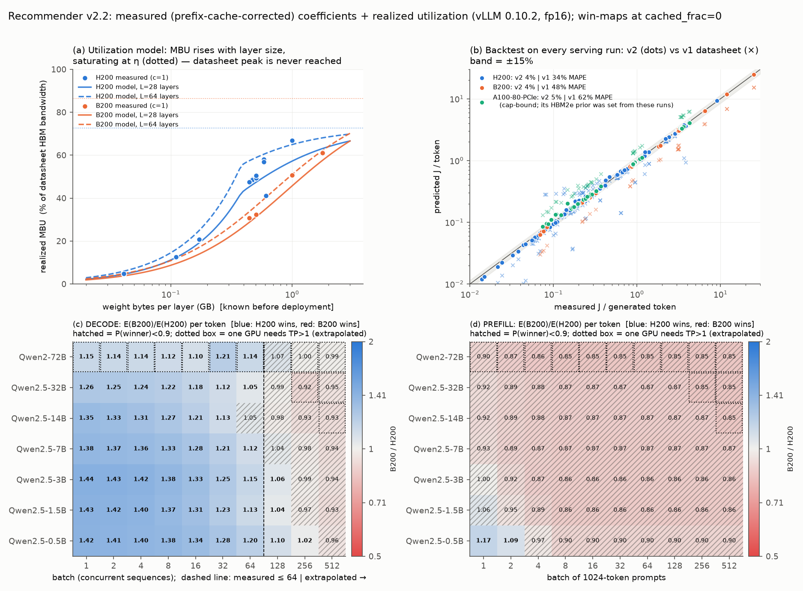
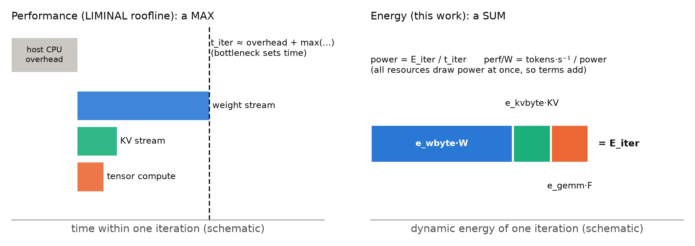
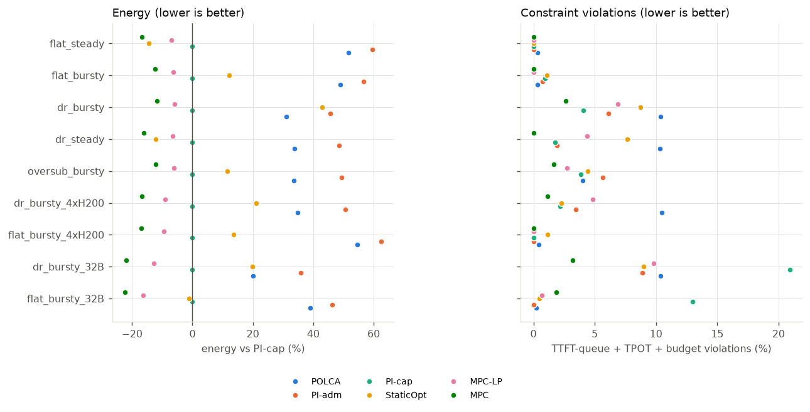

# Measured Energy Model for LLM Serving: PI Brief

*Status as of 2026-09-25. vLLM 0.10.2, fp16, one GPU. Measured on H200 (main GPU), B200 (second cluster) and RTX A5000 (GDDR6, power-capped). This replaces proposal v1. Its main claim, that energy coefficients scale with datasheet specs, is falsified. Section 3 explains.*

## Summary

- **Established:** on a given GPU, three measured coefficients predict serving energy for new models. They stay stable across a 64× range of model sizes and carry over to a held-out MoE.
- **Refuted:** energy per byte does not scale as 1/(datasheet bandwidth). A B200 costs 1.16× an H200 per byte. The law predicted 0.60×.
- **Probable:** energy per byte depends on memory technology. On GDDR6 it is 2.2–2.8× HBM3e. The evidence is medium-strong, because memory technology is confounded with process node and clock state.
- **What replaces v1:** the model's *structure* transfers between GPUs, but the *coefficient values* must be measured on each GPU. The recommender built this way predicts J/token within about 4% on both H200 and B200. v1 was off by 34–62%.
- **Applications:** the model tells which GPU is cheaper for each serving phase (decode on H200 is a confident result; prefill on B200 is probable). In simulation, a model-based fleet power controller uses 12–22% less energy than the best feedback baseline.

## 1. Question

Existing LLM-inference energy models pick two of three properties:

- **Interpretable:** roofline or analytical models such as LIMINAL, LLM-Viewer and "Tokens-to-Watt-hours". They use datasheet constants and have not been validated against measured power.
- **Measured and predictive:** WattGPU, a black-box learned model that excludes MoE.
- **Used for control:** POLCA, which caps power reactively and has no predictive model.

We asked whether one model can have all three: coefficients that are measured, physically meaningful and transferable. We then asked what two decisions such a model supports:

- (a) which GPU minimizes energy for each serving phase;
- (b) how to split a shared power budget across a mixed fleet while meeting latency SLOs.

## 2. Method



*Figure 1. Energy (Y) is measured and work (X) is computed from the model architecture, so the fitted coefficients have physical units (J/byte, J/FLOP) and can be checked for invariance.*

1. **Workload.** vLLM serves real variable-length prompts (alpaca and sharegpt) at concurrency 1, 4, 16 and 64, plus Poisson arrivals. On H200 this covers 4 dense 7–8B models, a Qwen2.5 size ladder from 0.5B to 32B, and one MoE (Qwen3-30B-A3B). On B200 it covers 7B, 32B and 72B.
2. **Logging.** NVML board power (about every 10 ms) and vLLM's per-iteration scheduler state (batch, resident KV tokens, prefill and decode tokens) share one clock. Both are binned into windows of about 200 ms.
3. **Regression.** In each bin, measured dynamic energy is the integrated power minus measured idle power times the bin length. It is regressed on *analytic* weight bytes, KV bytes and GEMM FLOPs from `models.py`, which uses LIMINAL-style accounting.
4. **Regression-free check.** At concurrency 1, each decode step reads all weights once. Dynamic energy divided by bytes over the run then gives J/byte directly. The cross-GPU comparison relies on this number.

## 3. Results

### 3a. Within one GPU the coefficients behave like hardware constants (established)

The H200 fit uses 9,274 bins from 4 dense models:

- `e_wbyte` = 1.066×10⁻¹⁰ J/B [95% CI 1.063, 1.069]
- `e_kvbyte` = 3.29×10⁻¹⁰ J/B [3.20, 3.37]
- `e_gemm` = 0.794 pJ/FLOP [0.773, 0.822]
- R² = 0.84. Held-out-by-model error (MAPE) = 6.6%.



*Figure 2. Calibrating on the other sizes predicts each held-out size from 1.5B to 32B within 4.6–6.9% error, and a single 7B calibration predicts every size at 7.2%. The 0.5B outlier (13.4%) runs at 5% memory-bandwidth utilization (MBU), far below the model's validity threshold (MBU ≳ 0.2). (This figure was made before the prefix-cache correction in §5. That correction mainly affects prefill FLOPs, which are a small share of energy here.)*



*Figure 3. Coefficients calibrated on dense models predict a held-out 30B MoE (R² 0.79, 21% error), but only after weight traffic is modeled by expert occupancy. Without that correction, R² is −1.35. (This is an earlier two-term calibration, before the prefix-cache correction.)*

For MoE layers, weight bytes are counted as the expected number of distinct experts a batch touches: `E·(1−(1−k/E)^t)`, where E is the number of experts, k the number active per token, and t the tokens in the batch. With this fix, the MoE's own fitted J/byte falls from 4.8 to 0.96×10⁻¹⁰, close to the dense models' value. This is independent evidence that the byte coefficient describes the hardware rather than the model.



*Figure 4. Decode-heavy bins spend about 94% of dynamic energy on memory traffic. Prefill-heavy bins spend about 30% on compute. The GPU choice therefore depends on the phase.*

**Caveat.** The memory coefficient is the robust one. The compute coefficient carries systematic uncertainty of tens of percent (§5).

### 3b. The datasheet scaling law failed across GPUs (refuted)

v1 assumed `e_byte ∝ 1/bandwidth`, so that coefficients for any GPU could be derived from its datasheet. All numbers below use one byte-counting convention (§5 describes a convention error we found and fixed).



*Figure 5. Measured energy per byte follows memory technology, not bandwidth. B200 is 16% above H200, where the law predicted 40% below. GDDR6 is 2.2–2.8× HBM3e, but only 0.4–0.5× what the law predicts.*

| GPU (memory, peak bandwidth) | Direct J/byte, Qwen2-7B, c=1 | 1/BW-law prediction |
|---|---|---|
| H200 (HBM3e, 4.8 TB/s) | 1.076×10⁻¹⁰ | anchor |
| B200 (HBM3e, 8.0 TB/s) | 1.252×10⁻¹⁰ | 0.646×10⁻¹⁰ |
| A5000 (GDDR6, 0.77 TB/s) | 2.70–2.78×10⁻¹⁰ (lower bound, capped at 100 W); DRAM-stream microbenchmark 2.6–3.1×10⁻¹⁰ | 6.7×10⁻¹⁰ |

**Alternative explanations we tested and ruled out:**

- **"A 7B model doesn't exercise the B200."** A 72B nearly doubled realized bandwidth (MBU 0.31 → 0.62). J/byte stayed flat at 1.24–1.26×10⁻¹⁰ across 7B, 32B and 72B.
- **"Analytic bytes miss on-chip traffic."** On the same A5000 at the same clock, serving costs 1.04–1.14× a pure weight-streaming GEMV per analytic byte.
- **"The law is rescued by a different idle floor."** Even an impossibly low 21 W floor gives 5.4×10⁻¹⁰ J/B for the A5000, still below the law's 6.7.

**What we think is true (medium-strong).** Energy per byte is set by memory technology. The observed ordering, in units of 10⁻¹⁰ J/B, is HBM3e (1.07–1.25) < HBM2e (about 1.75; weak, from power-capped A100 runs) < GDDR6 (2.7 or more). The DRAM share alone on GDDR6 is 22–28 pJ/bit, and about 30% of a streamed byte's energy is spent on-chip.

**Confounds.** Memory technology is confounded with process node (Samsung 8N vs TSMC 4N) and with the voltage/frequency operating point. All four A5000s on our node are capped at 100 W by another user. The serving number is therefore a lower bound, and the microbenchmarks carry the GDDR6 claim. **Open question:** why B200 costs 16% more per byte than H200 on the same memory technology.

### 3c. What worked instead: measured coefficients plus realized utilization (established on H200/B200)

The model structure transfers across GPUs. The coefficient values do not. Each GPU needs either a short calibration run or a memory-technology prior, which is labeled low confidence.

The time side also had to change. Datasheet-peak timing was replaced by a *realized-utilization* model fitted to our runs. It includes per-step host overhead, a per-layer latency floor, and a saturating MBU.



*Figure 6. (a) Realized MBU rises with weight bytes per layer and never reaches datasheet peak. (b) Predicted vs measured J/token on every serving run: the v2 model (dots) is within about 4%, while v1 (crosses) was off by 34–62%. (c, d) The H200 wins decode and the B200 is favored for prefill. Hatched cells are not confident (P < 0.9).*

- **Backtest on 137 measured runs.** J/token error is 4.1% on H200 (110 runs; 6.0% when each model is held out of the time-model fit) and 3.7% on B200 (27 runs). The B200 32B and 72B runs are out-of-sample for energy (4.9%, 3.7%).
- **Decode goes to H200 (confident).** H200 wins by 1.05–1.44× at up to 64 sequences, with P ≥ 0.9 nearly everywhere. B200's 16% higher J/byte and its 238 W idle power (vs 116 W for H200) are never paid back, because B200 runs only 1.1–1.3× faster in practice.
- **Prefill goes to B200 (probable, not confident).** B200 is about 13–15% cheaper for models of 3B or more at batch 4 or more, with P = 0.78–0.88. This rests on the compute coefficient and on a prior for prefill compute utilization (MFU).
- **v1's "L40S prefill / A100 decode" claim is withdrawn.** With memory-technology priors, A100 decodes 1.56–1.76× cheaper than L40S (P ≈ 1), because GDDR6 bytes are costlier, not because of 1/BW scaling. The L40S-prefill half is unsupported: it depends on the Ada compute coefficient, which we have not measured (P(L40S wins prefill) = 0.32–0.42).

## 4. The model now

```
E_bin − P_static·Δt = e_wbyte·weight_bytes + e_kvbyte·kv_bytes + e_gemm·gemm_flops
```

**How we got to three terms.** We verified these pooled H200 fits on corrected FLOPs:

| Terms in the fit | R² |
|---|---|
| Bytes only | −0.53 |
| Bytes + FLOPs | 0.66 |
| Weight bytes, KV bytes and FLOPs as separate terms | 0.84 |

On B200 the same comparison gives R² 0.64 → 0.69. A KV byte costs 3.1× a weight byte on H200 and 2.3× on B200. Plausibly this is because KV reads are smaller and more scattered, but we have not verified that.

**Terms we deliberately left out:**

- **An attention-FLOP term.** Decode attention is memory-bound, and within a model its work is exactly proportional to resident KV. The term is collinear with KV bytes and comes out unphysical (about 65 pJ/FLOP).
- **Model parameters as regressors.** They would be collinear with the byte counts, and they would turn hardware constants into per-model fits, which defeats the purpose.

| Coefficient | H200 | B200 | B200/H200 |
|---|---|---|---|
| e_wbyte (10⁻¹⁰ J/B) | 1.066 | 1.243 | 1.17 |
| e_kvbyte (10⁻¹⁰ J/B) | 3.29 | 2.85 | 0.87 |
| e_gemm (pJ/FLOP) | 0.794 | 0.642 | 0.81 |
| idle power (W) | 116 | 238 | 2.0 |

Source: `gpu_coefficients.json`. The fitted B200 `e_wbyte` (1.243) is slightly below its direct c=1 value (1.252); the 1.16× in §3b uses the direct values.

## 5. Measurement problems we found and how we handled them

- **Byte-counting convention (fixed).** A reconstructed copy of `models.py` counted both embedding tables, inflating Qwen2-7B weight bytes by 7.7%. The canonical file excludes the input-embedding gather. All cross-GPU numbers were re-binned under the canonical convention.
- **Prefix-cache over-count (corrected, adopted).** Logged prefill tokens include prefix-cache hits, which vLLM never computes: 26–36% of prompt tokens at c=64. Counting only computed tokens raises `e_gemm` by 17% (H200) and 19% (B200). The confidence intervals before and after do not overlap, and R² and held-out error both improve.
- **Possible NVML power smoothing (not adopted).** The per-bin data fit best as if power were smeared over about 0.4 s. Correcting for this would raise `e_gemm` by another 26–30% and move `e_wbyte` by only 1–2%. We have not yet determined whether the cause is 1 s averaging or a timestamp lag.
- **Net effect.** The memory coefficient is robust (±2%). The absolute compute coefficient is uncertain at the tens-of-percent level. The B200/H200 `e_gemm` ratio (0.79–0.81) holds under every variant, so the relative prefill conclusions stand.
- **Where the linear model breaks.** It fails on power-capped GPUs (A100-PCIe at 300 W, A5000 at 100 W), where energy ≈ cap × time and R² is negative. It also fails on models that saturate the GPU (72B on B200), where power barely varies. Such data are excluded from the coefficient table.

## 6. Relation to LIMINAL

LIMINAL is a roofline model of *time and performance*. We add the *energy* layer.



*Figure 7. Time is set by the bottleneck resource (a max). Energy adds up over all resources, which draw power at the same time (a sum). Dividing the two gives measured power and perf/watt instead of TDP-based estimates.*

- **How the pieces connect.** Each energy term maps to a roofline resource: weight bandwidth, KV bandwidth and tensor compute. Then `power = E_iter/t_iter` and `perf/W = (tokens/s)/power`, both from measured coefficients rather than TDP.
- **What the roofline misses.** Each step has a fixed host-CPU overhead of about 1.4–2.2 ms. The "about 45% MBU" in v1 was therefore an *effective* number. Asymptotic weight-streaming MBU is 0.72 on H200 and 0.86 on B200. The overhead is also why a 7B model runs only about 10% faster on B200 than on H200.
- **Accuracy.** The pure roofline predicts iteration time with 2–41% error. With the overhead term, error is 1.1–5.1% per GPU and model, holding out each run.

## 7. Application: fleet power control (simulation)

**The plant model.** We identified a discrete-time state model of one GPU serving one model:

- state: queue, running batch and KV occupancy;
- inputs: admission and power cap;
- outputs: power and throughput from the energy and time models.

For running batch, KV and throughput, it predicts 1–10 s ahead better than persistence (assuming nothing changes). For power it needs an added bias-correction term.

**The controller.** An economic MPC solves a mixed-integer linear program (MILP) every 1 s over per-GPU caps, routing and on/off decisions. Mean solve time is 8–42 ms for 2–8 GPUs.



*Figure 8. Across nine budget and load scenarios, MPC uses 12–22% less energy than the best feedback baseline (PI on the power cap), with equal or fewer SLO violations.*

- **The biggest saving is SLO-aware power capping, which any feedback controller gets.** It saves 48–52% vs uncapped by running at the lowest power that meets the latency target.
- **MPC's extra 12% (2×H200 + 2×B200, 7B), 17% (4×H200) and 22% (32B) comes from model-based allocation, not forecasting.** On the independently calibrated plant the gains are 9%, 14% and 18%. Consolidating work onto fewer GPUs is worth about 6%, and heterogeneity-aware routing 4–8%. A 1-step horizon nearly matches a 10-step one, and a perfect forecast adds only 0.8%.
- **Our hypothesis that MPC wins only when the budget fluctuates was refuted.** The gain is the same on flat and fluctuating budgets (−12.3% vs −11.8%). What matters is load variability: on steady load, a tuned static setting is within 2.5% of MPC.
- **Disaggregating prefill and decode buys SLO isolation, not energy, in this linear model.** The best split exactly ties colocated serving. Prefill does belong on B200 (9.3 vs 11.4 mJ/token for 7B).
- **Fragilities.** Heterogeneous routing flips with the B200's minimum settable power limit, which we have not measured. Without online adaptation, the MPC violates the latency target on 25–30% of 32B tokens.

**Closest prior work:** arXiv 2609.11133 (this month) applies MPC to prefill/decode power caps. It calibrates per configuration and does not address heterogeneous clusters. We cover heterogeneous fleets with a validated plant and find that the value comes from allocation, not forecasting.

**Not yet run:** a live closed-loop test on one A5000 is built and dry-run. The CPU simulation predicts about 20% lower J/token from batch-synchronous gating at a 30 s TTFT SLO.

## 8. Evidence at a glance

| Claim | Status |
|---|---|
| Memory coefficient is stable within a GPU across models, sizes (≥1.5B) and MoE (with occupancy bytes) | Established |
| J/byte scales as 1/bandwidth | Refuted (B200 and A5000) |
| J/byte is set by memory technology | Probable (one GDDR6 part, capped; process-node confound) |
| Recommender within ~4% J/token on measured GPUs | Established (H200, B200) |
| Decode is cheaper on H200 than on B200 | Established within the model (P ≥ 0.9) |
| Prefill is cheaper on B200 | Probable (P 0.78–0.88) |
| L40S cheaper for prefill | Unsupported (Ada compute energy unmeasured) |
| Absolute `e_gemm` | Uncertain (±tens of %); the ratio between GPUs is robust |
| MPC saves 12–22% vs best feedback | Simulation only |

**Not novel as a form:** the memory-plus-compute energy decomposition (Choi et al. 2013; Horowitz 2014) and phase disaggregation (DistServe, Splitwise). **Our contribution:** measured, validated coefficients; a measurement that falsifies datasheet scaling; MoE-aware bytes; and a validated time model with a controller built on it.

## 9. Next steps (by leverage)

1. **Validate byte counts on hardware with `ncu` on B200.** Our byte counts are analytic and have never been checked against hardware counters. Counters are blocked on the A5000 node (`ERR_NVGPUCTRPERM`).
2. **Settle `e_gemm`.** Run the NVML smoothing test ("square" test) on B200, then decide whether to adopt the correction.
3. **Run the live closed-loop control test on an A5000.** It is built; it needs one GPU-hour.
4. **Measure an uncapped GDDR6 or HBM2e point** to firm up the memory-technology ordering.

**Constraints on compute access:** H200 access was revoked on 2026-09-24; the H200 raw data is backed up. The only GPUs available locally are A5000s capped at 100 W by another user, and we cannot change power limits without root. The B200 cluster is the path for steps 1 and 2.
