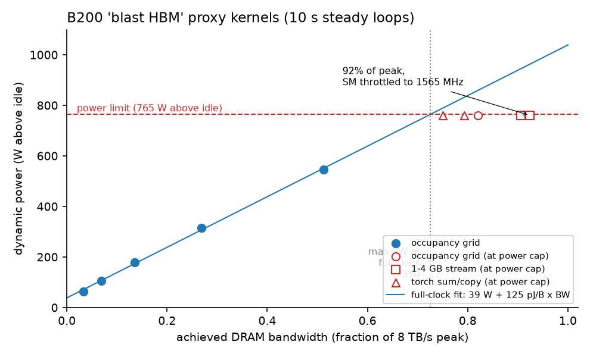
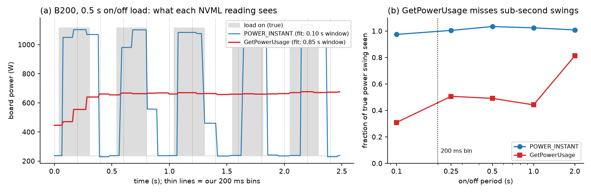
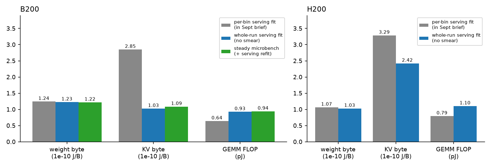
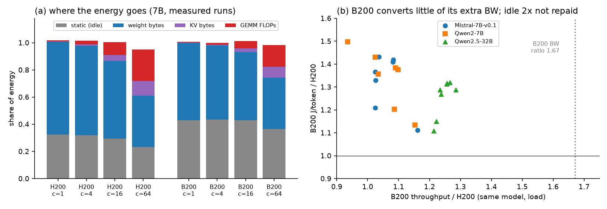

# Energy Model Update: Response to Feedback (October 2026)

Four experiments since the September brief, run on B200 and on our existing 110 H200/B200 serving runs. Each section covers what we ran and what it shows.

## 1. Do we saturate HBM? (proxy "blast HBM" kernels)

**What we ran.** Pure memory-read kernels on B200: 1–4 GB streams and an occupancy sweep from 3% to 92% of peak bandwidth. Each point is a 10-second steady loop with power read every 10 ms.

*Figure 1. B200 power vs achieved bandwidth. Power rises in a straight line, 39 W + 125 pJ per byte, up to the 1000 W power limit. Peak-bandwidth kernels reach 92% of 8 TB/s, but only at the limit, with the SM clock throttled to about 1565 MHz.*

**What it shows.**

- **HBM can be saturated, but the power limit gets there first.** At full clock, 1000 W allows about 73% of peak bandwidth. Reaching 92% means slowing the cores to free up power.
- **Serving does not saturate it.** Serving reaches 27–67% of peak, because most of each decode step is not spent reading memory. The fixed overhead is host/launch overhead plus a per-layer latency floor, and it does not shrink with a faster GPU. Bigger models amortize it better: Qwen2-72B on B200 reaches 62%. Qwen2-7B at batch 1:

| | step time | reading the 14.1 GB of weights at peak bandwidth | fixed overhead | bandwidth used |
|---|---|---|---|---|
| B200 | 5.4 ms | 1.8 ms | 3.6 ms | 33% |
| H200 | 6.0 ms | 2.9 ms | 3.1 ms | 49% |

- **Our serving energy-per-byte coefficient is pure memory-streaming energy.** The proxy kernel costs 1.251e-10 J/B against 1.243e-10 from serving (ratio 1.006).
- **Our byte counts are right.** Hardware counters read 1.004–1.008× the bytes our model assumes, in two separate captures. So the low bandwidth in serving is real underuse, not a counting error.

## 2. Is 200 ms sampling a problem? (square-wave power test)

**What we ran.** An on/off load at periods from 0.1 s to 2 s, logged with both NVML power readings, then fitted with a moving-average model.

*Figure 2. (a) Under a 0.5 s on/off load, POWER_INSTANT tracks every step, while GetPowerUsage (what our serving logger used) is nearly flat. (b) GetPowerUsage sees only 30–50% of sub-second power swings.*

**What it shows.** GetPowerUsage is a 0.85-second moving average on B200 (1.0 s on A5000), more than 4× our 200 ms bin. POWER_INSTANT is a 0.10 s average. Total energy is conserved, so J/token predictions are unaffected: within 2–5% over whole runs, with ≤ 1% bias. What breaks is assigning energy *within* a run to compute vs memory (section 3). From now on we log POWER_INSTANT and calibrate with long steady windows.

## 3. What the corrected coefficients are (GEMM loops + whole-run fits)

**What we ran.**

- **Steady loops.** Qwen2-7B layer-shaped matrix multiplies (GEMMs) at 1–8192 tokens, as 10 s steady loops. Points at the power cap are excluded, because throttling distorts energy per FLOP.
- **Whole-run refit.** The same energy model refit on whole-run totals (45 s windows), which averages out the smoothing.

*Figure 3. Energy coefficients from the September per-bin fit (grey), the whole-run fit (blue) and the steady loops (green). On B200 the two smear-free methods agree.*

**What it shows.** On B200:

- **Memory energy per byte is unchanged:** 1.22–1.24e-10 J/B under every method.
- **Compute is 0.93–0.94 pJ/FLOP, not 0.64.** Smoothing had pushed prefill energy into the wrong term.
- **A KV-cache byte costs about the same as a weight byte (1.03–1.09e-10), not 2.3×.** That 2.3× was a smoothing artifact. Physically this makes sense: both are DRAM reads.

H200 can only be partly corrected: compute rises to 0.95–1.10 pJ/FLOP, but KV stays at 2.4× a weight byte. Settling it needs the steady test, and we no longer have H200 access.

## 4. Overprovisioned or balanced? (all 110 serving runs + steady data)

**What we ran.** Each run's energy split into idle, weight bytes, KV bytes and FLOPs; same-workload H200 vs B200 comparisons; and a power-limit "roofline" built from the steady data.

*Figure 4. (a) Share of energy by component, 7B models. Idle power is 23–33% of energy on H200 and 36–45% on B200. (Panel (a) uses the September coefficients; with the corrected ones, GEMM's share grows.) (b) On the same workloads, B200 delivers 0.94–1.29× H200's throughput despite 1.67× the bandwidth, and costs 1.11–1.50× the energy per token.*

**What it shows.**

- **At the loads we ran, B200 is overprovisioned against H200.** It has 2× H200's idle power (238 W vs 116 W). Fixed overhead caps its throughput gain (section 1), so the extra idle power is never paid back.
- **Bandwidth is the capability worth paying for; compute is not, for decode.** On H200, at ≤ 50 ms per token:
  - Doubling FLOPs saves under 1.5% of energy per token, which would justify only 4–8 W of extra idle power.
  - 1.5× bandwidth saves 6–20%, which would justify 42–190 W.
  - Full B200 capabilities would justify 108 W (7B) to 240 W (32B) of extra idle; B200 actually carries 121 W. So B200 is marginally overprovisioned for 7B and justified from 14B up.
- **B200's compute is provisioned about 2.8× beyond its power budget.** Peak FLOPs would need about 2.1 kW above idle against a 765 W budget. Every prefill-sized GEMM runs at the power cap, reaching only 50–58% of peak FLOPs.
- **The energy balance point is 133 FLOP/byte, against a performance balance point of 281.** Decode runs at 1–90 FLOP/byte, so its energy is memory-dominated throughout.
- **Small models are the clearest overprovisioning.** A 0.5B model on H200 uses 5% of bandwidth and spends 68–80% of its energy on idle power.

## Other updates

- **LIMINAL's "5×" is a latency gap, not a power gap.** An H100 matrix-vector kernel (GEMV) was predicted at 146 µs and measured at 736 µs. The gap was cut from v2 and replaced by a fitted 114 µs/layer overhead, which matches our measured ~113 µs/layer. LIMINAL never measured power; it assumes TDP.
- **The 1/bandwidth energy law is now refuted for the DRAM channel too.** We measured per-channel energies on B200: DRAM 8.4e-11, L2 2.3e-11 and L1 1.0e-11 J/B. These rebuild the serving coefficient to within 3%. For the law to hold, H200's DRAM alone would need 130% of H200's total per-byte energy.
- **Recommender:** J/token error is unchanged (4.1% on H200, 3.7% on B200). The A100 memory prior was revised using EnergAIzer (ISPASS 2026).

## Next steps

1. Adopt the corrected B200 coefficients, and model the power-capped regime for prefill: at the cap the effective cost is about 0.6 pJ/FLOP.
2. Rerun B200 serving at concurrency 128–512. The model predicts that B200 overtakes H200 only at very large batches.
3. Log POWER_INSTANT in all future serving runs.
