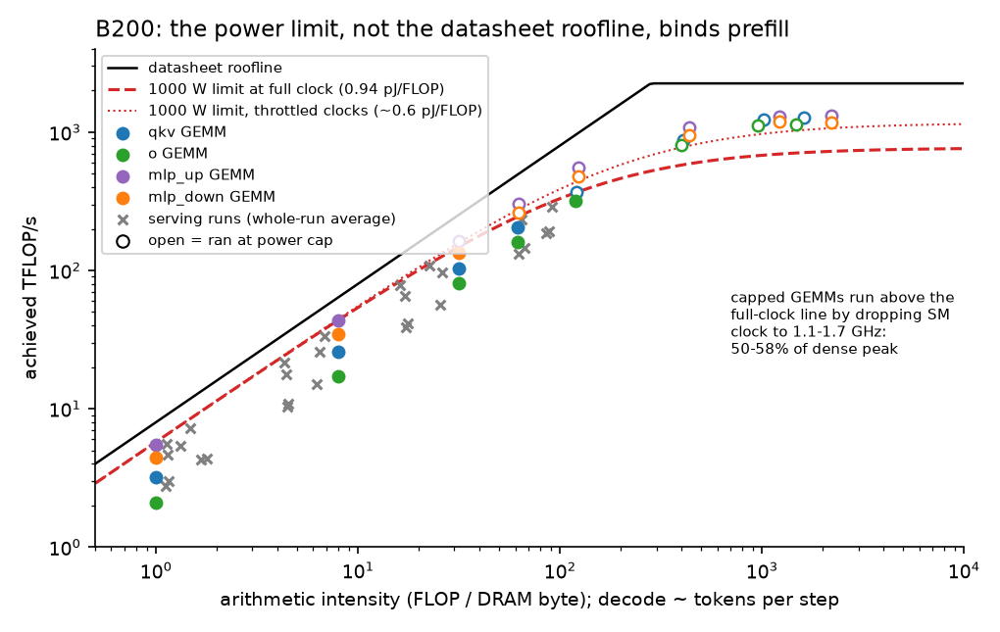

# Measured Energy Model for LLM Serving: Response to Feedback (October 2026)

This update follows the September brief (`PI_BRIEF`). It takes the feedback points one
at a time, then summarizes what has changed in the results.

**New since September:**
- a steady-state calibration on B200, using "blast HBM" proxy kernels, LLM-shaped GEMM
  loops and an NVML smoothing test;
- a second hardware-counter capture;
- per-channel energies measured on our own GPU;
- a balance/overprovisioning analysis over all 110 serving runs;
- a literature check of LIMINAL (both versions) and EnergAIzer (ISPASS 2026).

## Summary
- **We do not saturate memory in serving, and the reason is identified.**
  - Proxy kernels push B200 HBM to **92% of peak**.
  - Serving never exceeds 0.67 of peak (H200) and runs at **0.27–0.32 on B200 for 7B
    models**. Host and launch overhead sets the pace there: a 7B decode step takes
    5.4–7.7 ms on *both* GPUs.
- **The memory coefficient is confirmed from three directions.**
  - The proxy kernel at full clock costs **1.006×** the serving per-byte coefficient.
  - Per-channel energies (DRAM, L2, L1) measured on B200, combined with counter-measured
    serving traffic, reconstruct the serving coefficient to **−3%**.
  - Hardware counters still match our analytic byte count to **1.004–1.008**.
- **200 ms sampling: the problem is NVML's own averaging, now measured.**
  - `GetPowerUsage`, which our serving logger used, is a **0.85 s moving average** on
    B200. `POWER_INSTANT` is 0.10 s.
  - Consequence: our J/token predictions are unaffected (whole-run error 2–5%, bias
    ≤ 1%) and the memory coefficient is unaffected (±3%). The **split between compute
    and KV energy was wrong**: the true B200 compute coefficient is **0.93–0.94 pJ/FLOP,
    not 0.64**, and a KV byte costs **about the same as a weight byte, not 2.3×**. Two
    independent methods agree on both.
- **LIMINAL's "5×" is a latency gap, not a power gap.** LIMINAL never measured power.
  The 5× (an H100 GEMV) was cut from v2 and replaced by a fitted 114 µs/layer overhead,
  which matches our independently measured ~113 µs/layer.
- **Balance, answered at two levels:**
  - **Hardware.** B200's power limit, not its rooflines, is the binding resource. At
    full clock 1000 W sustains only about **73% of peak bandwidth or 36% of peak
    FLOPs**. Every prefill-sized GEMM runs at the power cap.
  - **Workload.** At the loads we measured, B200 costs **1.11–1.50× H200's J/token**.
    Its 2× idle power is not repaid by its 0.94–1.29× throughput. Extra FLOPs are
    worth ≤ 8 W of idle power for decode; extra bandwidth is worth 42–190 W.

---

## 1. "We might not be saturating the memory: blast HBM with constant read requests; try a proxy kernel"

**What we did.** We ran steady-state proxy kernels on B200, following EnergAIzer's
protocol:
- each operating point is a ≥ 10 s back-to-back loop;
- power is read at 10 ms from `POWER_INSTANT`;
- the kernels cover 1–4 GB streaming reads, an occupancy sweep (3% → 92% of peak BW),
  torch sum/copy, L2-resident and L1-resident streams, and Qwen2-7B layer GEMMs at
  1–8192 tokens.

*Figure 1. B200 proxy kernels. Below the power limit, power rises linearly with
bandwidth: 39 W + 125 pJ/B. The kernels reach **92% of peak** (EnergAIzer's A100
reached 82%), but only at the 1000 W limit, with the SM clock throttled to about
1565 MHz. At full clock the limit allows 73% of peak.*

**Results**
- **HBM can be saturated, and serving does not saturate it.** Realized serving
  bandwidth (fraction of peak):

  | | 7B | 32B | 72B |
  |---|---|---|---|
  | H200 | 0.39–0.49 | 0.58–0.67 | n/a |
  | B200 | 0.27–0.32 | 0.42–0.51 | 0.60–0.62 |

  The limit is host overhead (1.4–2.2 ms per step) plus a per-layer latency floor. A 7B
  model's step barely shortens on B200, so its extra bandwidth goes unused.
- **The serving coefficient is pure weight-streaming energy.** The full-clock proxy
  costs 1.251e-10 J/B against the serving fit's 1.243e-10, a ratio of **1.006**.
  Within the measured range energy per byte is constant. The apparent fall in J/B at
  high bandwidth comes from spreading a fixed 39 W of activity power over more bytes.
- **Per-channel energies, measured on our own GPU** rather than borrowed:

  | channel | energy per byte |
  |---|---|
  | DRAM | 8.37e-11 J/B |
  | L2 | 2.29e-11 J/B |
  | L1 | 1.00e-11 J/B |

  Combined with the counter-measured traffic of a serving decode, they predict the
  serving coefficient to **−3%**.
- **The 1/bandwidth scaling law is now refuted for the DRAM channel alone.** In
  September this was open. For the law to hold, H200's DRAM channel alone would need
  1.40e-10 J/B, which is 130% of H200's *entire* measured per-byte cost (1.076e-10).

## 2. "Bandwidth and inferences/s are things to track"

Every serving run now records realized TB/s, memory-bandwidth utilization (MBU),
compute utilization (MFU), arithmetic intensity, tokens/s, **requests/s**, J/token,
**J/request**, median step time and the energy split (`balance_runs.csv`, 110 runs).
Representative rows:

| GPU / model | concurrency | TB/s | MBU | req/s | J/request | idle share of energy |
|---|---|---|---|---|---|---|
| H200 Qwen2-7B | 1 / 64 | 2.37 / 1.95 | 0.49 / 0.41 | 0.9 / 43 | 447 / 12 | 31% / 23% |
| B200 Qwen2-7B | 1 / 64 | 2.59 / 2.18 | 0.32 / 0.27 | 1.0 / 48 | 612 / 14 | 42% / 36% |
| H200 Qwen2.5-32B | 1 / 64 | 3.21 / 2.78 | 0.67 / 0.58 | 0.2 / 12 | 1883 / 57 | 26% / 18% |
| B200 Qwen2.5-32B | 1 / 64 | 4.05 / 3.36 | 0.51 / 0.42 | 0.3 / 14 | 2517 / 64 | 32% / 28% |
| B200 Qwen2-72B | 1 / 16 | 4.90 / 4.82 | 0.61 / 0.60 | 0.1 / 2.0 | 5960 / 448 | 28% / 26% |

Two B200 runs were found to be invalid and are excluded. In both, the load generator
stalled: 17 requests completed, and average power was at or below idle.

## 3. "Assumed wake read count is close to bandwidth"

*We read this as: the number of DRAM reads our model assumes (from the model's
weights and KV cache) should match what the hardware actually reads, so that
bandwidth = reads ÷ time. If you meant something else (for example, HBM wake-ups from
low-power states), see the note at the end of this section.*

**Confirmed with hardware counters, in two independent captures.**
- On B200, `ncu` DRAM bytes ÷ our analytic bytes = **1.004** (8 tokens, 3,004
  kernels) and **1.008** (24 tokens, 9,120 kernels).
- Every proxy kernel does what its name says (DRAM stream 1.001; L2-resident stream
  0.001 DRAM / 1.004 L2).
- The batch-1 GEMV proxy crosses L2 1.565× per DRAM byte, against 1.567× for the real
  serving decode. **The proxy kernel is a faithful stand-in for decode traffic.**
- So the byte counts under every coefficient are right to under 1%. The bandwidth gap
  in §1 is real underuse, not a counting error.
- *If "wake" refers to HBM power-state transitions:* we have no counter for those.
  The indirect evidence is the occupancy sweep (Figure 1): power is linear in bandwidth
  from 3% to 51% of peak, with a fixed 39 W of activity power. So any per-wake energy
  is either part of that 39 W or proportional to bytes read; we see no separate term.

## 4. "LIMINAL is 5× off between its analytical and runtime models"

We read both arXiv versions, including the TeX source and commented-out material
(`LIT_LIMINAL.md`).
- **The 5× is a latency gap.** An H100 GEMV was predicted at 146 µs and measured at
  736 µs (v1, Appendix E). They blamed launch latency and poor prefetch. The measured
  time implies about 22% of peak bandwidth, which suggests an untuned microbenchmark.
- **It was cut from v2.** v2 instead fits a per-layer overhead to vLLM profiles:
  **95–138 µs/layer, mean 114**, with bandwidth forced to peak. Our independently
  measured host overhead is **~113 µs/layer** (H200).
- **LIMINAL has no measured power.** Its power is TDP plus datasheet DRAM power (HBM4
  at about 30 pJ/B, never measured) and does not depend on activity. Time resolution
  plays no part in their gap.
- **Where we stand relative to it:**
  - Our time model fits *both* a utilization slope (asymptotic MBU 0.72 on H200, 0.86
    on B200) and the overhead intercept.
  - Our energy model is measured and activity-dependent.
  - The recommender predicts J/token within **4.1% (H200) and 3.7% (B200)**.

## 5. "200 ms sampling is a lot, especially when integrated into power"

**Measured directly.** We ran on/off square-wave loads with periods of 0.1–2 s and fit
each NVML reading as a moving average plus a lag.

*Figure 2. (a) Under a 0.5 s on/off load, `POWER_INSTANT` follows each step;
`GetPowerUsage`, the reading our serving logger used, is nearly flat. (b) `GetPowerUsage`
sees about 30–50% of a sub-second power swing. Fits: `GetPowerUsage` = 0.85 s window,
0.02 s lag (B200; 1.0 s on A5000); `POWER_INSTANT` = 0.10 s window, no lag.*

**What this does and does not break**
- **It does not break J/token.**
  - Energy is conserved under averaging, so whole-run totals are right. Our per-bin
    coefficients predict whole-run energy within 1.9–4.9% with ≤ 1% bias.
  - The recommender results (about 4%) stand.
- **It does not break the memory coefficient.** The weight-byte coefficient moves ≤ 3%
  under every correction.
- **It does break the compute-vs-KV split.** Prefill bursts are short, so the 0.85 s
  average spreads their energy into neighbouring bins, and the per-bin regression
  credits it to the wrong term. Two smear-free methods agree on the corrected values:

*Figure 3. Per-bin coefficients (grey, as in September) against two smear-free
estimates: a whole-run fit, where 45 s windows integrate out the averaging (blue), and
the steady microbenchmark, refitting serving with its compute coefficient (green). On
B200 the two methods agree: compute **0.93–0.94 pJ/FLOP** (per-bin 0.64), and KV byte
**1.03–1.09e-10 J/B** (per-bin 2.85e-10), about equal to a weight byte. Physically this
makes sense: both are DRAM reads.*

- **H200 is only partly resolved.** The whole-run fit raises compute to about
  0.95–1.10 pJ/FLOP. KV stays at 2.4× a weight byte, and with H200 access gone we cannot
  run the steady calibration that settled B200.
- **Protocol from now on:**
  - log `POWER_INSTANT`;
  - calibrate in steady state (≥ 10 s points);
  - treat per-bin attribution between terms with caution.

## 6. "Is the system overprovisioned, or balanced, on energy as well?"

**Definition we used.** A capability is overprovisioned when its idle (static) power
costs more energy per token than it saves at the target latency.

### 6a. Hardware: the B200 is power-limited

*Figure 4. B200 throughput vs arithmetic intensity. The black line is the datasheet
roofline. Red lines show what 1000 W allows using our measured energy per byte and
per FLOP (dashed: full clock; dotted: throttled clocks).*

- At full clock, peak bandwidth would need about 1,040 W of dynamic power and peak
  FLOPs about 2,120 W. The budget above idle is 765 W.
- Every LLM GEMM with ≥ 512 tokens (3 of 4 shapes already at 128) runs at the limit.
  It reaches only 50–58% of dense peak, by dropping the SM clock to 1.1–1.7 GHz.
- **Energy ridge 133 FLOP/B vs performance ridge 281.** At 133 FLOP/B, compute energy
  equals weight-streaming energy. Serving decode sits at 1–90 FLOP/B, so its dynamic
  energy is memory-dominated everywhere.
- **The B200's compute is provisioned about 2.8× beyond its power envelope.** Decode
  never reaches the limit. Prefill is power-limited.

### 6b. Workload: at the loads we ran, B200 is overprovisioned against H200

*Figure 5. (a) Energy split for 7B serving: idle power is 23–33% of energy on H200 and
36–45% on B200. (b) On matched runs (same model, load), B200 delivers only 0.94–1.29×
H200's throughput against a 1.67× bandwidth ratio, and costs 1.11–1.50× the J/token.
(Panel (a) uses the September per-bin coefficients; with the corrected ones, GEMM's
share grows and KV's shrinks.)*

**Results**
- Idle power is 2.04× H200's, and the throughput gain does not pay for it: idle energy
  per token is 1.6–2.2× H200's.
- **Small models are the clearest overprovisioning:** Qwen2.5-0.5B on H200 runs at MBU
  0.05 with **68–80% of its energy spent on idle power**.
- **Which capability is worth paying idle power for?** Model counterfactual on H200,
  per-token latency ≤ 50 ms, idle held fixed:

  | upgrade | J/token saving | idle power it could justify |
  |---|---|---|
  | 2× FLOPs | 0.7–1.5% | +4 to +8 W |
  | 1.5× bandwidth | 6–20% | +42 to +190 W (it also needs a higher power limit, or it caps at 700 W) |
  | full B200 capabilities | 11–22% | +108 W (7B), +142 W (14B), +240 W (32B) |

  The B200 actually carries **+121 W**. On this test it is marginally overprovisioned
  for 7B and justified from 14B up.
- **It becomes balanced only with very large batches.** If each GPU runs the largest
  batch that meets the latency target, the model predicts B200 is 11–32% cheaper per
  token. That needs batches of about 200–1,900, far beyond the measured concurrency of
  ≤ 64, so it is an extrapolation. Balance therefore depends on load, which makes it a
  consolidation and capacity-planning question as much as a hardware one.

---

## What changed since the September brief

| Claim | September | Now |
|---|---|---|
| 1/BW law for the DRAM channel alone | Unestablished (borrowed per-channel energies) | **Refuted** with our own per-channel energies (needs 130% of H200's total) |
| Per-byte coefficient = DRAM + on-chip | Plausible, split borrowed | **Reconstructed** from measured channels to −3%; full-clock proxy = 1.006× serving |
| Byte counts match hardware counters | 1.004 (one capture) | **1.004 and 1.008** (two captures, 3× data); proxy matches serving L2 traffic |
| NVML smoothing | Suspected (~0.4 s), not adopted | **Measured:** `GetPowerUsage` 0.85 s, `POWER_INSTANT` 0.10 s |
| Absolute compute coefficient (B200) | Uncertain, ±tens of % | **0.93–0.94 pJ/FLOP** from two independent methods (per-bin 0.64 biased low) |
| KV byte vs weight byte (B200) | 2.3×, unexplained | **≈ 1×**; the 2.3× was a smearing artifact (H200 still open) |
| J/token predictions (~4%) | Established | **Unchanged**; robust to the smoothing correction |
| Serving saturates HBM? | Not tested | **No:** 0.27–0.67 vs 0.92 achievable; overhead-bound |
| Balance / overprovisioning | Not addressed | **Quantified:** B200 power-limited; overprovisioned vs H200 at measured loads; FLOPs ≤ 8 W, BW 42–190 W of justified idle |
| LIMINAL 5× | Taken at face value | **A cut latency gap**; no measured power; their 114 µs/layer matches our 113 |
| A100 (HBM2e) energy per byte | 1.75e-10 prior, from runs at TDP | **1.36e-10** (EnergAIzer boost-clock point); A100 J/token error 13% zero-shot |
| Decode cheaper on H200 | P ≥ 0.9 | Unchanged at measured loads. B200 can win only at very large batches (extrapolated) |
| Prefill cheaper on B200 | Probable (P 0.78–0.88) | **Needs re-evaluation:** B200 prefill runs at the power cap, and the compute coefficients are being revised |

## Open items and next steps
1. **Adopt the corrected coefficients?** For B200, that means compute 0.94 pJ/FLOP and
   KV ≈ weight byte. J/token barely moves; the prefill ranking and the energy ridge do.
   The recommender also needs a power-capped mode for prefill: at the cap, the
   effective cost drops to about 0.6 pJ/FLOP because of the lower clock and voltage.
2. **Test "balanced if fed" on B200.** Rerun serving at concurrency 128–512. This is a
   direct, runnable test of the model's prediction that B200 overtakes H200 at large
   batches.
3. **Make `POWER_INSTANT` the source** for all serving bins going forward.
4. **H200 KV coefficient (2.4×):** this needs a steady calibration on H200, and access
   is revoked.
5. **Constraints:** neither cluster allows clock locking or power-limit changes. So no
   frequency-sweep or power-cap experiments; we stratify by recorded clocks instead.

*Sources: `FINDINGS_B200.md` (UPDATE 4, 4b and the review), `BALANCE.md`,
`LIT_LIMINAL.md`, `LIT_ENERGAIZER.md`, `RECOMMENDER.md` (v2.4). Figures:
`pi_update_figs/make_figs.py`.*
